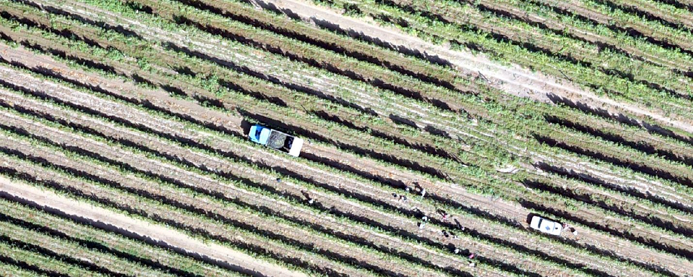
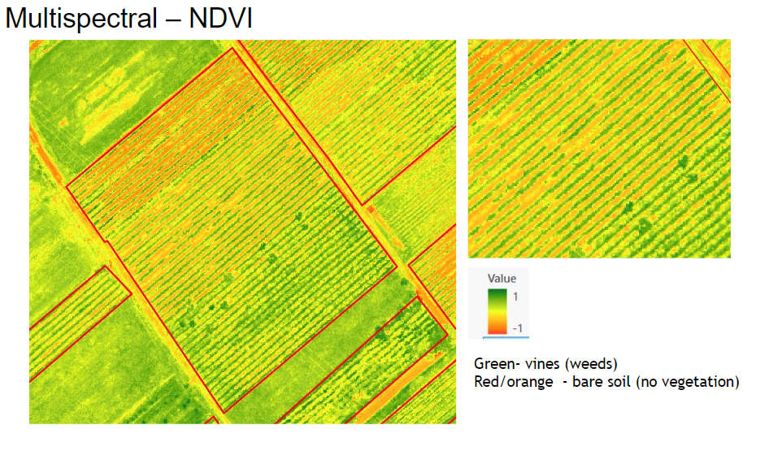

# Hi there, I'm Gohar!

### 🌍 Welcome to my Geographic Information Systems and Remote Sensing Portfolio 🌏

Here, I document and share my expertise in GIS and Remote Sensing, grounded in a solid academic foundation in Geoinformation Science and Earth Observation for Environmental Modeling and Natural Resource Management from the University of Twente and Lund University, and a B.A. in Environmental Studies from Bates College.

My career has spanned multiple impactful projects that leveraged the power of GIS for environmental conservation, urban planning, and data management. Feel free to peruse through my GIS and Remote Sensing projects below, showcasing my commitment to leveraging geospatial technologies for sustainable development and innovative solutions.

## 💡 Technical Skills and Tools

- **GIS Tools:** Expertise in QGIS, ArcGIS Pro, ERDAS for spatial data analysis, visualization, and database management.
- **Programming:** Proficient in SQL for database queries and management. Skilled in JavaScript and Python for Google Earth Engine applications.
- **Data Analysis:** Advanced abilities in data integrity enhancement, quality assurance and control, strategic analysis, and reporting.
- **Education & Training:** Demonstrated success in curriculum development, teaching, and professional training within the GIS domain.

## ⚙️ Project Experience

- **[Vineyard Registry System](#vineyard-registry)** 
- **[Waste Management Optimization](#waste-management)**
- **[Google Earth Engine Training Program](#google-earth-training)** 
- **[Creative Cartography](#creative-cartography)** 
  - [Hurricanes](#hurricanes)
  - [Massachusetts](#massachusetts)
  - [World Shipping in 1770](#world-shipping-in-1770)
  - [Race from Spain to Puerto Rico](#Spain)
  - [SteelHead Haven Mudslide Event](#steelhead-haven-mudslide-event)
- [Fantasy Cartography](#Fantasy-Cartography)
- **[Academic Projects](#academic-projects)**
  - [Analysis of Arctic Ice Extent and Implications for Global Shipping Routes](#arctic-ice)
  - [GIS and Remote Sensing Analysis of Food Security in Africa](#food-security-africa)
  - [Evaluating the Impact of Drought and Temperature Increase on Dutch Agriculture](#dutch-agriculture)
  - [Ecological Sensitivity Assessment in Katla Geopark, Iceland](#katla-geopark)
  - [Trail Condition in Katla Geopark](#trail-condition)

## ✉️ Connect with me via [LinkedIn](https://www.linkedin.com/in/goharshahinyan/).

### 🗺️ Charting New Territories in GIS: My Quest for Terrain, Innovation, and Teamwork

- 📈 I’m actively working on enhancing the Vineyard Registry System, delving into fire prediction in Siberia's Boreal Forests, sharpening my skills with the Python API of Google Earth Engine through Jupyter Notebooks. Oh, and fueling my passion for crafting maps that are as informative as they are visually captivating.
- 🐍 I’m currently learning more about machine learning applications in remote sensing, especially advanced Python scripting for spatial data analysis.
- 🌿 I’m looking to collaborate on projects focusing on environmental conservation through GIS.
- 💬 Ask me about any GIS and Remote Sensing projects, especially in agricultural and urban planning contexts.
- 🚀 Fun fact1: I've trained professionals in Google Earth Engine, without myself having a comprehensive knowledge of GEE, but the course was so successful that it led to new GIS-based employment opportunities for several students.
- 🍇 Fun fact2: In parallel to developing the Vineyard Registry, I cultivate boutique wines under my family brand. This vine-to-bottle journey reflects work—melding tradition with innovation, one exquisite drop at a time.

# The Vineyard Registry: A Geospatial Revolution in the Wine (QGIS, ArcGIS Pro)

## My Leadership in Advancing the Vineyard Registry

As the GIS and Remote Sensing Expert, I directed the technical development of the Vineyard Registry, meticulously reviewing, mapping, and analyzing over 12,000 hectares of vineyards. My strategic approach and expertise in GIS and Remote Sensing were instrumental in elevating data integrity and enhancing registry accuracy by 70%. This achievement translated into a refined resource for grape traceability, positioning the country to thrive in the competitive global wine market.

## Core Contributions

- **Technical Proficiency:** Demonstrated expert knowledge in ArcGIS and QGIS, executing spatial data analysis and precise mapping that underpinned the entire registry infrastructure.
- **Quality Control Prowess:** Instituted stringent quality control measures, ensuring exceptional data reliability.
- **Operational Insight:** Steered the integration of vineyard parcels with cadaster data, enhancing the granularity of the registry and enabling accurate farmer information collation.
- **Strategic Communication:** Provided essential maps and materials for project communication, effectively translating complex geospatial data into engaging visual content that resonated with stakeholders and facilitated project advocacy.
- **Expert Collaboration:** Fostered collaboration with an array of international and national experts, playing a pivotal role in strategizing and advancing the development of the registry, ensuring it met global standards and local needs.

## Vineyard Registry Development Steps

### Geospatial Analysis and Quality Assurance in Vineyard Registry Development

#### Satellite Analysis for Vineyard Identification

High-resolution Sentinel-2 satellite imagery and unsupervised classification methods were utilized by a specialized third party to identify potential vineyard areas. I leveraged statistical data from individual municipalities to augment this analysis, successfully uncovering missed vineyard areas in at least three administrative territories, showcasing a meticulous approach to comprehensive coverage.

#### Orthophotography Acquisition and Quality Oversight

Drone flights were conducted over identified potential vineyard locations, acquiring orthophotography with up to 20 cm pixel resolution in both RGB and multispectral formats. This third-party work aimed to achieve detailed imagery crucial for precise vineyard parcel demarcation. My responsibility was to conduct rigorous quality control over the drone imagery collection process, identifying and addressing issues such as image blurriness and coverage gaps, ensuring the highest quality of visual data.

#### Visual Interpretation and Parcel Delimitation

The task of delimiting individual vineyard parcels, encompassing an extensive area of 12,000 hectares, was undertaken by an external team. My role involved overseeing the quality and accuracy of vineyard parcel delineation, implementing necessary edits to refine the parcel boundaries and guarantee precise mapping.

#### Comprehensive Data Collection and Quality Control

I developed a detailed guide to enhance data accuracy, covering aspects from orthophoto quality to the exactness of vineyard parcel delineation and the standardization of attribute data. This meticulous approach laid the groundwork for robust quality control practices.

#### Integrating Vineyard and Cadaster Data

The delineated orthophoto vineyard parcels were systematically overlaid with cadaster parcels to aggregate comprehensive information about each farmer, spanning approximately 80,000 cadaster units. This overlay process underwent a thorough quality assurance review, leading to the creation of a final dataset enriched with all necessary alphanumeric and graphical details. This dataset served as the foundation for a Survey123 survey aimed at gathering farmer information. Post-survey, I undertook the extensive task of data cleaning and preparation, optimizing the information for integration into the vineyard registry. This exhaustive effort underscored my commitment to creating a reliable and valuable resource for the viticulture sector.

### Vineyard Insights: Advancing Viticulture with Remote Sensing Technologies

Remote sensing technology has revolutionized viticulture by providing vintners with a bird's-eye view of their vineyards, allowing for precise monitoring and management of vine health. This technology harnesses the power of satellite imagery and aerial photography to analyze soil properties, track vegetation growth, and detect water stress levels. Through the application of various spectral indices, such as NDVI, viticulturists can make informed decisions about irrigation, harvesting, and disease control, leading to enhanced grape quality and more efficient vineyard operations.

The Normalized Difference Vegetation Index (NDVI) is a powerful tool for assessing vineyard quality, offering insights into vegetation health and vigor. By measuring the difference between near-infrared (which healthy vegetation strongly reflects) and red light (which vegetation absorbs), NDVI provides a clear indicator of plant stress, allowing viticulturists to monitor and manage vine growth, detect disease, and optimize irrigation. This remote sensing technique is instrumental in precision viticulture, enabling the identification of variability within vineyards and guiding targeted interventions to maintain the highest standard of grape quality.

### Project Impact

The comprehensive Vineyard Registry now catalogues over 20,367 parcels across 223 communities, serving as an indispensable tool for the viticulture sector's monitoring and quality assurance. My leadership in this initiative underscores a deep-seated commitment to enhancing agricultural data management, fostering operational excellence, and enabling economic growth in the viticulture domain.

# Waste Management Optimization (ArcGIS, Network Analyst, PPGIS, Survey123 Connect)
Implemented location-allocation analysis and Public Participation GIS to optimize the placement of solid waste bins in urban areas. This project involved advanced GIS applications for urban planning, demonstrating significant improvements in waste management efficiency. 

# Google Earth Engine Training Program (Google Earth Engine, JavaScript)

Designed and delivered a curriculum focused on advanced LULC analysis, grassland carrying capacity modeling, and programming in GEE JavaScript. Enhanced the GIS skills of professionals, with four students securing GIS-based employment. [Visit the GEE LULC Code Here](https://code.earthengine.google.com/29d809bf52b5e1e1455ae3762e53d358)

# GIS E-Learning Modules and Web Platform (Public Participation GIS)

Led the development of seven e-learning modules and a comprehensive web platform for the GAtES project. This initiative improved access to educational content on ecosystem services and engaged a wide audience through a [virtual conference and multimedia content](https://ace.aua.am/gates).

# Creative Cartography

The maps featured in this section were meticulously crafted as part of Esri's renowned **Cartography** MOOC. Through this educational and entertaining experience, I deepened my understanding of aesthetic and functional elements of map design, applying these principles to create visually compelling and informative maps. Showcased here, these maps not only demonstrate my technical proficiency but also my ongoing commitment to expanding my cartographic skills and knowledge.

## Hurricanes

## Massachusetts

## World Shipping in 1770 - Go Ahead, Click on the Image to View the Animation

## Race from Spain to Puerto Rico - Go Ahead, Click on the Image to View the Video

## SteelHead Haven Mudslide Event - Go Ahead, Click on the Image to View the Video

## Fantasy Cartography

This unique map of Yerevan City, styled after the iconic maps of Middle-earth from J.R.R. Tolkien's "The Lord of the Rings," showcases my creative flair and versatility with cartographic design. Crafted as a whimsical gift and for entertainment, it fuses the historic essence of Yerevan with the fantasy aesthetic of Tolkien's universe. I employed styles developed by John Nelson (JohnMNelson_esristyles), available here, with ArcGIS Pro to transform the vibrant cityscape of Yerevan into a piece of fantasy art.

  

# Academic Projects

## Analysis of Arctic Ice Extent and Implications for Global Shipping Routes

In my investigation spanning from 1979 to 2017 on the Arctic ice extent, I leveraged advanced GIS and remote sensing methodologies to delineate the patterns of ice melt and to uncover the consequent economic opportunities and environmental challenges. A pivotal aspect of my analysis focused on charting both the existing and emergent shipping pathways made accessible due to the diminishing Arctic ice, a topic of growing significance in the realms of global commerce and environmental stewardship. One of the most notable observations emerged in September 2012, when the Arctic ice shrank to a mere 3.57 million km², underscoring an alarming decline in ice coverage. This analysis brought to light the alternative shipping routes, notably reducing the distance between Rotterdam and San Francisco by up to 2000 km.

## GIS and Remote Sensing Analysis of Food Security in Africa

In my analysis, I utilized the Global Agro-Ecological Zones (GAEZ) model to delve into the complexities of yield gaps, Length of Growing Period (LGP), and population density, successfully identifying regions in Africa susceptible to food insecurity. By adopting the rigorous methodologies outlined by Mueller et al. (2012), I conducted detailed calculations and analyses of yield gaps, significantly enhancing insights into the continent's agricultural strengths and obstacles.

- Conducted Yield Gap Fraction Analysis: Analyzed maize yield gaps using Lund University's GISN22 course data, applying the equation \(YG_{\text{fraction}} = \frac{YG}{YG_{\text{potential}}}\) in ArcGIS. Isolated yield gap data for Africa to perform a targeted examination of areas with potential food production challenges.
- Evaluated Length of Growing Period (LGP): Reclassified LGP data across Africa to categorize food security levels, associating longer growing periods with enhanced food production potential. This assessment shed light on the variability of agricultural productivity in relation to ecological conditions.
- Analyzed Population Density: Investigated the impact of high population density on food insecurity, recognizing the increased demand for food in densely populated areas. This analysis underscored the significance of demographic factors in the landscape of food security.

References:
Mueller, N.D., Gerber, J.S., Johnston, M., Ray, D.K., Ramankutty, N., & Foley, J.A. (2012). Closing yield gaps through nutrient and water management. Nature, 490, 254-257.

| Africa Yield Gap Analysis |Africa LGP and Population | Africa Food Insecurity |
|:-----------------------:|:----------------------------:|:----------------------:|
| |  |  |

## Evaluating the Impact of Drought and Temperature Increase on Dutch Agriculture

I addressed the pivotal issue of climate change, focusing on assessing how drought and rising temperatures affect agricultural practices in the Netherlands. Leveraging GIS and remote sensing technologies, I effectively mapped out the progression of these climate extremes and analyzed their potential impacts on one of the most prolific agricultural systems globally.

Analysis of Agricultural Land Changes (2000 vs. 2012): Utilizing CORINE Land Cover data, I created maps that reveal a 3% reduction in agricultural land over a span of 12 years. This observation is critical in highlighting the intricate relationship between environmental dynamics and land use, especially in the Netherlands—a nation known for its dense population and extensive agricultural cultivation.

Drought Index Analysis for 2000 and 2012: Drawing on data from the European Climate Assessment & Dataset project, I generated maps illustrating the drought index, characterized by days without rainfall. This index proved essential in identifying periods of significant water stress, potentially detrimental to crop production. Through this analysis, I pinpointed regions within the Netherlands that are particularly vulnerable to drought, thereby providing valuable insights for mitigating future agricultural risks associated with climate change.

| Netherlands Drought 2000 | Netherlands Drought 2012 |
|:------------------------:|:------------------------:|
|  |  |

## Ecological Sensitivity Assessment in Katla Geopark, Iceland

In this comprehensive GIS project, I aimed to delineate wilderness areas and assess ecological sensitivity within Katla Geopark. The initiative focused on mapping regions free from significant human activity and evaluating the park's vulnerability to tourism-related disturbances. By integrating analyses of land cover, soil types, and terrain steepness, I sought to identify and quantify pristine landscapes and areas at risk, contributing to the park's sustainable tourism and conservation strategy.

### Achievements and Methodology

- **Delineation of Wilderness Areas:** I identified nine significant wilderness cores, collectively covering 40% of Katla Geopark. These efforts underscored the diverse and untouched natural landscapes essential for conservation, ranging from 31.24 km² to 2232.28 km².
- **Viewshed and Buffer Zone Analysis:** Utilizing Digital Elevation Models (DEMs), I executed a viewshed analysis to discern areas obscured from human-made structures, establishing a 5 km buffer zone around indicators of human presence. This methodology balanced simplicity with the nuanced portrayal of wilderness areas.
- **Advanced GIS Techniques:** Through map algebra and polygon conversion, I delineated and merged visibility zones into a comprehensive layer that pinpointed potential wilderness areas, refining the park's conservation priorities.

### Ecological Sensitivity Mapping

This project segment involved classifying the park's terrain, land cover, and soil types into sensitivity categories to evaluate their resilience against physical impacts from tourism. This analysis highlighted critical areas requiring targeted conservation measures.

- **Slope Sensitivity Analysis:** Classified the park's terrain steepness to assess how topographical variations impact ecological vulnerability.
- **Land Cover Sensitivity:** Assessed the park's land cover for its resilience to tourism disturbances, assigning sensitivity ranks to highlight areas in need of protection.
- **Soil Sensitivity Evaluation:** Evaluated soil types for susceptibility to degradation, emphasizing the importance of soil conservation in areas frequented by tourists.

| Katla Slope Sensitivity | Katla Land Cover Sensitivity | Katla Soil Sensitivity |
|:-----------------------:|:----------------------------:|:----------------------:|
|  |  |  |

### Combination Analyses for Conservation Planning

- **Multiplicative Value Combination:** Offered a detailed assessment by integrating variable sensitivities, unveiling regions where combined factors heighten ecological fragility.
- **Protection Level Assessment and Tourism Analysis:** Mapped protection levels based on environmental legislation and bio-physical properties, then analyzed 81 tourist attractions for their placement within these levels. This strategic alignment ensures that tourism development respects the park's ecological sensitivities.

| Katla Sensitivity Overview | Katla Protection Levels | Katla Attractions |
|:--------------------------:|:-----------------------:|:------------------:|
|  |  |  |

## Trail Condition in Katla Geopark

In my comprehensive examination of Katla Geopark's environmental sustainability, a particular focus was placed on the conditions of hiking trails within the park. Through meticulous GIS mapping and analysis, I evaluated the trail conditions across 293 sample points, classifying them from minimal to severe impact. This assessment revealed a spectrum of trail conditions, highlighting areas where the confluence of high foot traffic and ecological sensitivity necessitates urgent attention and action, guiding recommendations for trail maintenance, development of alternative pathways, and visitor management strategies to mitigate adverse effects.

## Disclaimer for Academic_Projects Repository

The projects and files contained within this GitHub repository, "Academic_Projects," are provided for educational purposes only. They represent work completed as part of academic coursework or research by the repository owner, gshahiny. All content is provided "as is" without warranty of any kind, express or implied, and in no event shall the contributors be liable for any claim, damages, or other liability arising from the use of the material.

Users are welcome to fork, study, and discuss the projects, but any use of the provided material must acknowledge the source and adhere to any licensing terms specified for each project. It's also advised to respect the privacy and intellectual property rights of any data or code that might be included or referenced.

Please be advised that not all data sources used in these projects are directly cited within this repository. Many datasets and resources were provided through educational institutions affiliated with gshahiny, underscoring a commitment to academic integrity and collaboration. The contents may not always mirror the latest best practices or methodologies in the respective fields of study and should be engaged with as a foundation for learning, requiring appropriate validation and customization for academic or professional application.

